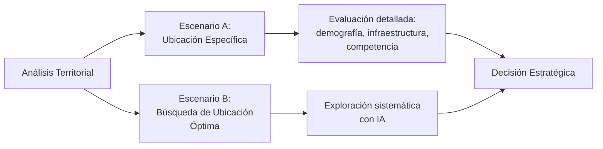

```js
import mermaid from "npm:@observablehq/mermaid";
```
# Geosmart by STRTGY: Metodología de Análisis

## Definiciones Clave

*   **Geosmart:** Es el framework tecnológico y metodológico propietario de STRTGY para el análisis geoespacial avanzado. Integra múltiples fuentes de datos, técnicas de SIG (Sistemas de Información Geográfica) y modelos de Inteligencia Artificial (IA) para generar inteligencia territorial.
*   **EVA (Enterprise Virtual Assistant):** Es la *aplicación específica* del framework Geosmart configurada para el proyecto Paragon. EVA opera como la solución analítica de STRTGY para evaluar la viabilidad y optimizar las decisiones de desarrollo inmobiliario de Paragon en sus proyectos específicos.

## Propuesta para Análisis de Viabilidad Territorial

EVA es la solución desarrollada por STRTGY para transformar datos en inteligencia estratégica, facilitando decisiones de desarrollo inmobiliario para Paragon. Geosmart es el núcleo técnico de este enfoque, integrando análisis avanzado y modelos de IA para evaluar oportunidades territoriales de manera integral.

Utilizamos diversas fuentes de datos como [Ejemplos: Censos INEGI, Directorio Estadístico Nacional de Unidades Económicas (DENUE), datos de movilidad anonimizados, imágenes satelitales Sentinel/Landsat, datos de redes sociales, información catastral, etc.].

## Temas Principales e Ideas Importantes

### De la Recolección de Datos a la Inteligencia Estratégica

El verdadero diferenciador en el mercado inmobiliario no es solo recopilar datos, sino convertirlos en información accionable. Como afirma Fabián Salazar, CTO y Co-fundador de STRTGY:

> "En STRTGY, estamos convencidos de que el verdadero diferencial en el mercado inmobiliario no se encuentra únicamente en la recolección de datos, sino en la habilidad de convertirlos en inteligencia estratégica que impulse la toma de decisiones."

### Introducción de EVA (Analista de Viabilidad Territorial)

EVA va más allá de los estudios tradicionales de ubicación, integrando IA para proyectar tendencias, identificar oportunidades de negocio y personalizar estrategias. Su objetivo es proporcionar una comprensión profunda de las ubicaciones potenciales.

### Beneficios para Paragon

- **Optimización de Operaciones:** Decisiones más informadas y estratégicas, mayor eficiencia operativa y ventaja competitiva.
- **Anticipación de Oportunidades:** Identificación de áreas de crecimiento potencial antes que la competencia mediante modelos predictivos avanzados.
- **Fortalecimiento de Relaciones:** Mejor alineación de proyectos con las demandas del mercado, mayor satisfacción y lealtad del cliente.
- **Crecimiento Sostenible:** Decisiones respaldadas por datos confiables, contribuyendo a la estabilidad y expansión controlada de la empresa.

### Especialización y Necesidades de Paragon

El enfoque está dirigido al desarrollo y comercialización de propiedades residenciales, hospitalarias y comerciales (retail, hoteles, restaurantes) en San Luis Potosí y otras regiones estratégicas de México. Se reconoce la necesidad de una metodología clara para la toma de decisiones, desde la selección de ubicación hasta la conceptualización del producto.

### Dos Escenarios de Análisis



- **Escenario A: Análisis de Ubicación Específica**  
  Evaluación detallada de una ubicación predeterminada para determinar su potencial de desarrollo, considerando demografía, infraestructura, competencia y normatividad. Incluye estudios de mercado, proyecciones de demanda y evaluación de riesgos específicos del sitio.

- **Escenario B: Búsqueda de Ubicación Óptima**  
  Exploración sistemática de zonas extensas para identificar las mejores ubicaciones según el tipo de desarrollo deseado. Utiliza algoritmos avanzados de IA para procesar múltiples capas de datos territoriales, generando mapas de calor de idoneidad, identificando clusters de oportunidad y proponiendo ubicaciones justificadas con datos.

### Enfoque Comercial

El análisis se centra en aspectos comerciales, de mercado y de cumplimiento normativo general, excluyendo detalles financieros como cálculos de ROI. Se considera la relevancia de la seguridad social para la vivienda (créditos Infonavit, Fovissste) para la identificación del mercado objetivo.

## Detalles de la Metodología

### Cobertura Geográfica

Principalmente San Luis Potosí y áreas urbanas/semi-urbanas de interés para Paragon, pero adaptable a otras regiones.

### Tipos de Proyectos

Cubre residencial (varios segmentos), hospitales (con enfoque comercial) y plazas comerciales (incluyendo retail, hoteles y restaurantes).

### Áreas de Análisis

- **Regulatorio/legal:** Zonificación, uso de suelo.
- **Urbano/infraestructura:** Accesibilidad, servicios.
- **Demográfico/mercado:** Perfil de población, competencia, hábitos de consumo, seguridad social para vivienda.
- **Propuesta de valor:** Amenidades, tecnología, sostenibilidad.
- **Recomendaciones de comercialización.**

### Proceso del Escenario A (Coordenada Específica)

<!-- Insertar Diagrama Flujo Escenario A -->

1. **Caracterización de la Ubicación:**  
   Análisis de uso de suelo, restricciones legales, servicios públicos, infraestructura y accesibilidad.

2. **Diagnóstico Comercial:**  
   Perfil sociodemográfico, análisis de competencia, segmentación de mercado con IA.

3. **Evaluación de Viabilidad:**  
   Cumplimiento normativo, seguridad, calidad de vida, análisis de sentimiento en redes sociales.

4. **Conclusiones:**  
   Viabilidad de cada tipo de proyecto, oportunidades de diferenciación y recomendaciones estratégicas.

### Proceso del Escenario B (Región Más Amplia)

<!-- Insertar Diagrama Flujo Escenario B -->

1. **Definición de Criterios y Ponderación:**  
   Accesibilidad, servicios, oferta de terrenos, seguridad y criterios específicos por tipo de proyecto.

2. **Recopilación y Cruce de Datos Territoriales:**  
   Uso de SIG, IA para análisis multicapa, clustering y modelos predictivos.

3. **Selección Preliminar de Sitios Candidatos:**  
   Análisis multicriterio, optimización y filtros normativos/ambientales.

4. **Validación de Campo y Contexto Local:**  
   Visitas in situ, imágenes satelitales, consulta con actores locales y análisis de sentimiento.

5. **Identificación de la Ubicación Óptima:**  
   Propuestas detalladas, mapas interactivos y recomendaciones finales.

### Directrices Específicas por Tipo de Proyecto

- **Vivienda:** Demanda, precios, competencia, propuesta de valor, estrategias de comercialización.
- **Salud:** Demanda y cobertura, competencia, especialidades, accesibilidad, posicionamiento de marca.
- **Plazas Comerciales:** Perfil y demanda del público, análisis socioeconómico, hábitos de consumo, competencia, sinergias entre componentes.
- **Análisis Adicional:** Tendencias del mercado, proyecciones de crecimiento, impacto ambiental, regulaciones.

## Entregables Típicos

Los resultados se presentan mediante una combinación de:

*   Reportes analíticos detallados.
*   Dashboards interactivos con visualizaciones.
*   Capas de datos geoespaciales (ej. GeoJSON, Shapefiles) para integración en sistemas GIS del cliente.
*   Mapas temáticos estáticos y dinámicos.
*   Presentaciones ejecutivas con hallazgos clave y recomendaciones.
