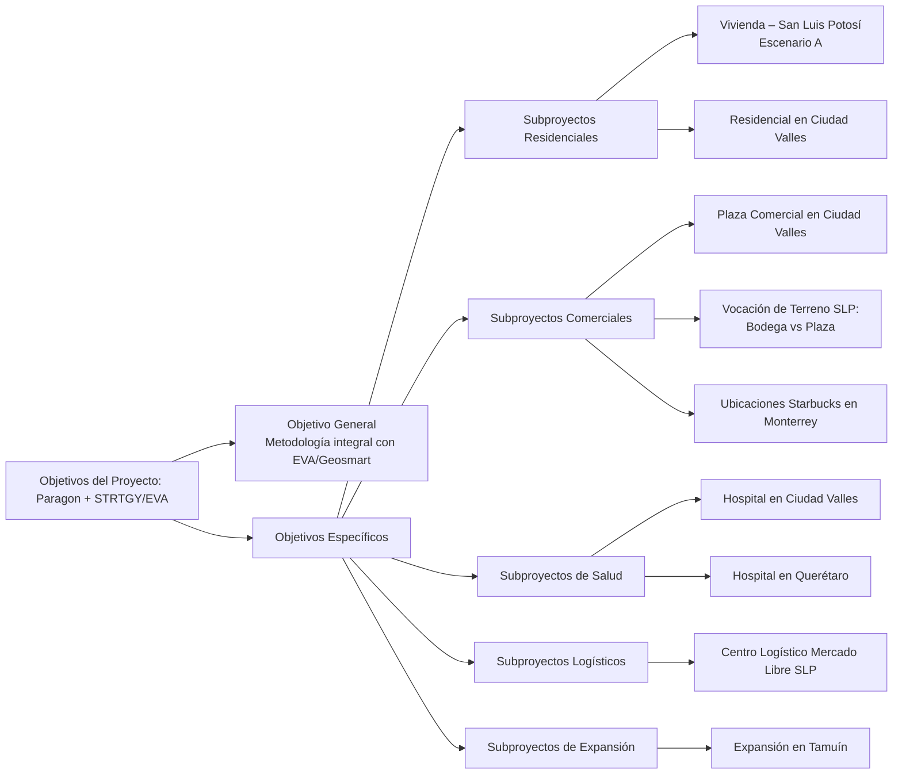

# Objetivos del Proyecto: Paragon + STRTGY/EVA

## Introducción

Esta sección presenta los objetivos del proyecto de análisis de viabilidad territorial para **Paragon**, desarrollado por **STRTGY** mediante la solución **EVA (Enterprise Virtual Assistant)**, basada en el framework **Geosmart**. Los objetivos, alineados con la propuesta aprobada, establecen una base clara y medible para el proyecto, aplicando el enfoque SMART y definiendo KPIs para su seguimiento. El análisis abarca los ámbitos: Urbano/Infraestructura, Demográfico/Mercado, Propuesta de Valor y Recomendaciones de Comercialización.

## Objetivo General

Brindar a Paragon una metodología integral, apoyada en análisis territoriales y herramientas de inteligencia artificial (EVA/Geosmart), que facilite la toma de decisiones estratégicas para el desarrollo inmobiliario. El objetivo es optimizar la asignación de recursos y minimizar riesgos, siempre con base en criterios técnicos y de mercado sólidos.

## Objetivos Específicos

A continuación, se presentan los objetivos específicos del proyecto, redactados de manera clara y orientados a los intereses y necesidades del cliente:

---

## Subproyectos Residenciales

### 1. Vivienda – San Luis Potosí (Escenario A: Territorio Amplio)

> **Nota:** Este objetivo se encuentra en pausa hasta confirmar con el cliente si el enfoque debe ser territorial amplio o predio específico.

Buscamos identificar las zonas con mayor potencial para desarrollos residenciales en San Luis Potosí, utilizando información oficial y análisis geoestadístico. El propósito es elaborar un ranking de áreas que, por su conectividad, acceso a créditos de vivienda, cercanía a centros de trabajo y escuelas, así como su nivel de competencia y amenidades, representen las mejores oportunidades para invertir en vivienda. Todo esto se realizará bajo una metodología estructurada y basada en datos, para maximizar el éxito de los proyectos residenciales.

### 2. Residencial en Ciudad Valles

El objetivo es conocer a fondo el mercado y el perfil de los compradores potenciales de vivienda en Ciudad Valles, poniendo especial atención en el acceso a créditos INFONAVIT y FOVISSSTE. Se analizarán los segmentos de demanda, el potencial de colocación de vivienda y la competencia local, así como la proximidad a servicios y equipamiento urbano. De esta manera, se facilitará la toma de decisiones sobre el tipo de producto residencial más adecuado para la zona.

---

## Subproyectos Comerciales

### 1. Plaza Comercial en Ciudad Valles

Queremos analizar el mercado para definir el mejor mix comercial y evaluar la viabilidad de incluir un concepto gastronómico tipo steakhouse. Se estudiará la demanda potencial, el atractivo de la ubicación para locatarios actuales y futuros, y la competencia en la zona, considerando la cercanía de otras plazas, restaurantes, cines y supermercados, así como el flujo vial. El objetivo es optimizar la ocupación de locales y el posicionamiento comercial del proyecto.

### 2. Vocación de Terreno SLP: Bodega vs Plaza

El propósito es comparar, de manera objetiva, el desarrollo de una bodega industrial frente a una plaza comercial en San Luis Potosí. Se analizarán indicadores de demanda, competencia y conectividad, integrando datos oficiales y de mercado, para apoyar la decisión estratégica sobre el uso óptimo del terreno, considerando tanto el acceso logístico como el potencial de cada opción.

### 3. Posibles ubicaciones de Starbucks en Monterrey

Nos proponemos identificar entre 5 y 7 ubicaciones ideales para nuevas sucursales de Starbucks en Monterrey, considerando criterios de Alsea, densidad poblacional, tráfico y proximidad a puntos de interés. Se generará un ranking de ubicaciones utilizando modelos de análisis espacial y clustering predictivo, con el fin de maximizar el éxito comercial y la cobertura de mercado, asegurando accesibilidad y visibilidad óptimas.

---

## Subproyectos de Salud

### 1. Hospital en Ciudad Valles

El objetivo es evaluar la viabilidad territorial y el perfil socioeconómico para el desarrollo de un hospital en Ciudad Valles. Se analizará la demanda insatisfecha de servicios de salud, la competencia existente y la accesibilidad de las ubicaciones propuestas, integrando información de diversas fuentes para reducir riesgos de inversión y optimizar la ubicación del hospital.

### 2. Hospital en Querétaro

Buscamos identificar tres ubicaciones óptimas para un hospital en Querétaro, considerando la demanda insatisfecha y la densidad poblacional. Se evaluará el potencial de cada sitio mediante un análisis multicriterio, tomando en cuenta requisitos legales, especialidades con menor competencia y el radio de influencia, con el objetivo de maximizar la captación de pacientes y la diferenciación competitiva.

---

## Subproyectos Logísticos

### 1. Centro Logístico Mercado Libre SLP

El objetivo es analizar la viabilidad de establecer un centro logístico de Mercado Libre en San Luis Potosí, enfocándonos en la infraestructura y la conectividad regional. Se evaluará la ubicación del terreno respecto a vías principales y nodos logísticos, así como la proximidad a otros centros de distribución, para optimizar la logística y la cobertura regional, y aprovechar el potencial de crecimiento logístico en la zona.

---

## Subproyectos de Expansión

### 1. Expansión en Tamuín

Nos proponemos evaluar el potencial de desarrollo en Tamuín, considerando el impacto del nuevo aeropuerto y las proyecciones de crecimiento. Se analizarán las áreas geográficas cercanas al aeropuerto, la competencia y la saturación del mercado, así como la identificación de segmentos de mercado potencial, con el fin de detectar oportunidades de inversión y expansión estratégica para Paragon.

---

> **Nota:** Cada subproyecto cuenta con un análisis detallado en la sección correspondiente de la metodología Geosmart, donde se profundiza en los criterios, fuentes de datos y resultados esperados.
