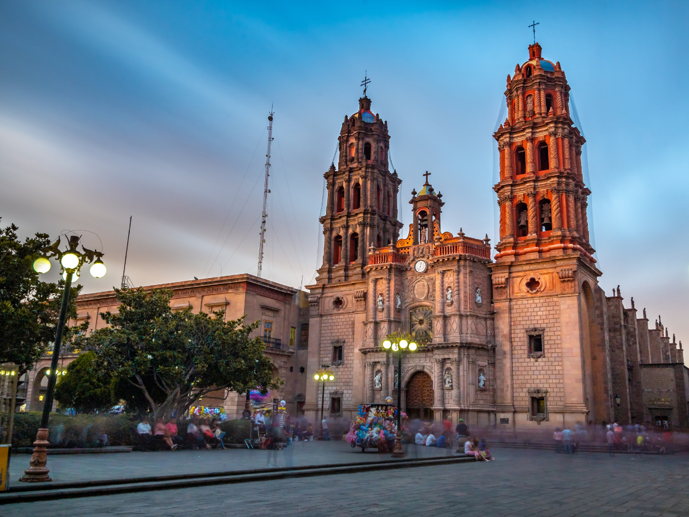
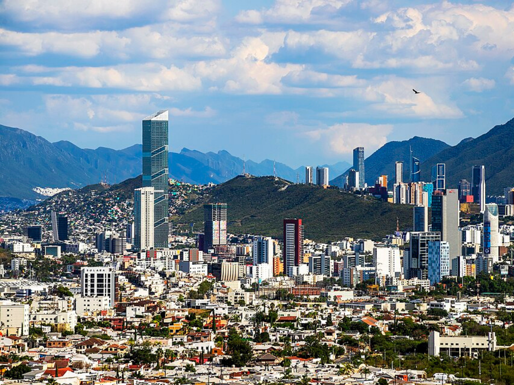
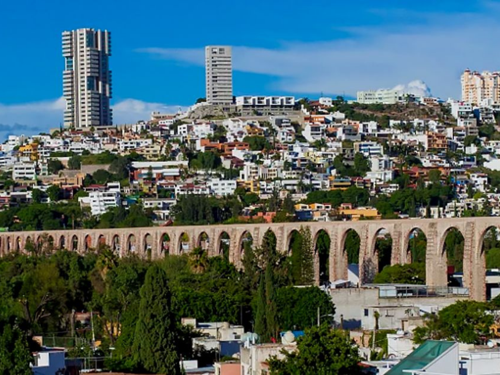
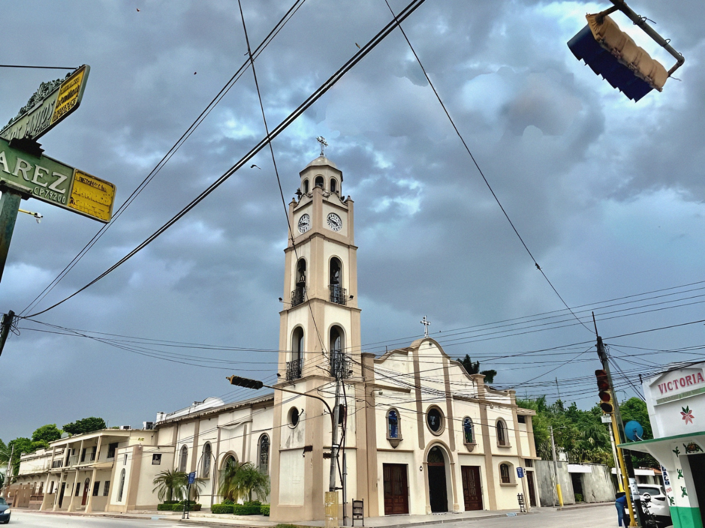

# Comparativa Territorial

## Propósito

Esta sección presenta una evaluación comparativa exhaustiva entre zonas y ciudades clave dentro del portafolio de Paragon. Su objetivo es contextualizar cada terreno frente a otros territorios con características demográficas, socioeconómicas, de infraestructura y de mercado similares o contrastantes. Este análisis facilitará la identificación de ventajas competitivas, áreas de oportunidad y posibles desafíos, proveyendo una base sólida para la toma de decisiones estratégicas de inversión y desarrollo.

## Metodología e Indicadores Evaluados

Para realizar una comparación robustaS, se han evaluado los siguientes indicadores:

### Demografía:
- Población total y su crecimiento histórico.
- Densidad poblacional.
- Edad mediana y estructura poblacional.
- Proyecciones de población.

### Nivel Socioeconómico (NSE):
- Distribución de los niveles socioeconómicos (AMAI).
- Ingreso promedio (cuando disponible).

### Dinamismo Económico:
- Principales sectores económicos y su contribución al PIB local/estatal.
- Inversión Extranjera Directa (IED) y nuevas inversiones.
- Parques industriales y principales empleadores.
- Zonas y corredores de oficinas.

### Infraestructura y Accesibilidad:
- Proximidad a centros de trabajo.
- Accesibilidad vial: calidad y conectividad de la red carretera.
- Transporte público: oferta y calidad.
- Infraestructura aeroportuaria y ferroviaria (si aplica).

### Equipamiento Urbano:
- Competencia y oferta comercial: principales centros comerciales.
- Competencia y oferta médica: hospitales públicos y privados, clínicas especializadas, afiliación a servicios de salud.
- Infraestructura educativa: principales universidades y centros técnicos, matrícula en educación superior.

### Mercado Inmobiliario:
- Precios promedio de vivienda (venta y renta).
- Tendencias del mercado.
- Principales desarrollos inmobiliarios y zonas de expansión.

### Calidad de Vida:
- Seguridad pública: incidencia delictiva y percepción de seguridad.
- Espacios recreativos y oferta cultural.

### Planeación Estratégica:
- Planes de desarrollo estatal y municipal.
- Proyectos de desarrollo urbano e infraestructura relevantes.

## Perfil de Ciudades y Zonas Analizadas

  

## **📍 San Luis Potosí, SLP**

- **Población total (2020):** 1,243,980 habitantes (ZMSLP)
- **Edad mediana:** 29 años
- **Densidad poblacional:** 105.9 hab/km² (ZMSLP)
- **Nivel socioeconómico (AMAI 2022):** A/B: 8%, C+: 12%, C: 14%, C-: 16%, D+: 14%, D: 24%, E: 12%
- **Crecimiento poblacional (2010-2020):** 19.56% (ZMSLP)
- **Proximidad a centros de trabajo:** Alta, múltiples parques industriales (Logistik II, Tres Naciones, WTC SLP, Millennium, Fundidores)
- **Accesibilidad vial:** Conectividad con carreteras federales 57 y 70, proyectos de segundo piso y nuevo anillo periférico
- **Competencia comercial:** Alta, múltiples centros comerciales (El Dorado, Plaza San Luis, Plaza Sendero, nuevos proyectos)
- **Competencia médica:** Alta, hospitales públicos de referencia (HGZ No.1 IMSS, Hospital Central) y privados (Hospital Angeles)
- **Afiliación a servicios de salud:** 82.45% de la población
- **Principales sectores económicos:** Manufactura (automotriz con GM, BMW), comercio y servicios
- **Precio promedio vivienda (venta):** $5,129,152 (casas)
- **Percepción de inseguridad:** 71.9% (Ciudad SLP, 2025)
- **Potencial de desarrollo:** Muy alto, impulsado por inversión industrial y proyectos de infraestructura

*Fuentes: INEGI, AMAI, IMCO, Vivanuncios, ENVIPE*

  

  

## **📍 Ciudad Valles, SLP**

- **Población total (2020):** 179,371 habitantes
- **Edad mediana:** 28 años
- **Densidad poblacional:** 76 hab/km²
- **Nivel socioeconómico promedio:** Medio-bajo
- **Crecimiento poblacional (2010-2020):** 6.95%
- **Proximidad a centros de trabajo:** Media, actividades turísticas y comerciales
- **Accesibilidad vial:** Acceso a carreteras regionales (Federal 70 SLP-Tampico) y proximidad a zonas turísticas
- **Competencia comercial o médica:** Media, oferta de servicios médicos y comercios locales
- **Afiliación a servicios de salud:** 68% de la población
- **Actividades económicas destacadas:** Turismo (principal puerta de entrada a la Huasteca Potosina), comercio y servicios
- **Infraestructura vial:** Acceso a carreteras regionales, mejora de la Carretera Valles-Tampico en desarrollo
- **Potencial de desarrollo:** Ligado principalmente al turismo regional

*Fuentes: INEGI, Secretaría de Economía, Cuentame de México, City Facts*

  

  

  

## **📍 Monterrey, NL**

- **Población total (2020):** 5,784,442 habitantes (ZM)
- **Edad mediana:** 30 años
- **Densidad poblacional:** 760 hab/km² (urbana)
- **Nivel socioeconómico (AMAI 2022):** A/B: 12%, C+: 15%, C: 19%, C-: 19%, D+: 16%, D: 16%, E: 3%
- **Crecimiento poblacional (2010-2020):** 9.1%
- **Proximidad a centros de trabajo:** Muy alta, gran concentración de oficinas corporativas y parques industriales
- **Accesibilidad vial:** Amplia red de avenidas y transporte público metropolitano (Metrorrey)
- **Competencia comercial o médica:** Muy alta, múltiples hospitales de prestigio nacional e internacional y centros comerciales
- **Afiliación a servicios de salud:** 80% de la población (76.8% IMSS, 7.05% seguros privados)
- **Tiempo promedio de traslado al trabajo:** 37.6 minutos
- **Sectores económicos predominantes:** Manufactura diversa, acero, cemento, alimentos, servicios financieros
- **Potencial de desarrollo:** Alto, polo de atracción de inversión con mercado inmobiliario sofisticado

*Fuentes: INEGI, AMAI, Secretaría de Economía*

  

  

  

## **📍 Querétaro, QRO**

- **Población total (2020):** 2,368,467 habitantes (ZM)
- **Edad mediana:** 29 años
- **Densidad poblacional:** 203 hab/km²
- **Nivel socioeconómico (AMAI 2022):** A/B: 11%, C+: 15%, C: 19%, C-: 18%, D+: 14%, D: 17%, E: 6%
- **Crecimiento poblacional (2010-2020):** 29.6% (el más alto entre las ciudades comparadas)
- **Proximidad a centros de trabajo:** Alta, polos industriales (automotriz, aeroespacial) y de servicios
- **Accesibilidad vial:** Excelente conectividad con CDMX y el Bajío, transporte público en expansión
- **Competencia comercial o médica:** Alta, hospitales de calidad y oferta comercial moderna
- **Afiliación a servicios de salud:** 75% de la población (59.8% IMSS, 4.69% seguros privados)
- **Principales sectores económicos:** Automotriz, aeroespacial, TI, logística y servicios
- **Infraestructura vial:** Buena conectividad con autopistas y parques industriales
- **Potencial de desarrollo:** Muy alto, beneficiándose de ubicación estratégica y ambiente de negocios favorable

*Fuentes: INEGI, AMAI, Secretaría de Economía, Datos del Gobierno de México*

  

  

## **📍 Tamuín, SLP**

- **Población total (2020):** 36,968 habitantes
- **Edad mediana:** 27 años
- **Densidad poblacional:** 40 hab/km²
- **Nivel socioeconómico promedio:** Bajo
- **Crecimiento poblacional (2010-2020):** -2.6% (decrecimiento)
- **Proximidad a centros de trabajo:** Baja, actividades agrícolas y ganaderas predominantes
- **Accesibilidad vial:** Proximidad al nuevo Aeropuerto Nacional de la Huasteca, carreteras regionales
- **Competencia comercial o médica:** Baja, oferta limitada de servicios médicos y comercios
- **Afiliación a servicios de salud:** 60% de la población
- **Principales actividades económicas:** Agricultura, ganadería y comercio local
- **Infraestructura vial:** Carretera Federal 70 (SLP-Tampico) atraviesa Tamuín
- **Potencial de desarrollo:** Alto, debido a inversiones en infraestructura aeroportuaria que podrían impulsar logística y turismo

*Fuentes: INEGI, Secretaría de Economía*
    
  

## Matriz Comparativa de Indicadores Clave

| Indicador | ZMSLP | Monterrey (ZM) | Querétaro (ZM) | Ciudad Valles | Tamuín |
|-----------|-------|----------------|----------------|---------------|--------|
| Población 2020 | 1,243,980 | 5,784,442 | 2,368,467 | 179,371 | 36,968 |
| Crecimiento Pob. 2010-2020 | 19.56% | 9.1% | 29.6% | 6.95% | -2.6% |
| Edad Mediana | 29 (SLP), ≤28 (SGS) | 30 | 29 | 28 | 27 |
| NSE (% A/B+C++C, AMAI 2022) | 34% | 46% | 45% | Medio-bajo | Bajo |
| Principales Sectores | Automotriz, Manufactura | Manufactura diversa, Servicios financieros | Automotriz, Aeroespacial, TI | Turismo, Comercio | Agricultura, Ganadería |
| Precio Promedio Vivienda (Casa) | $5,129,152 | Mayor que ZMSLP | Mayor que ZMSLP | Menor que ZMSLP | Significativamente menor |
| Percepción Inseguridad | 71.9% | Variable | Mejor que SLP | No disponible | No disponible |
| Potencial Desarrollo | Muy alto | Alto | Muy alto | Medio (turismo) | Alto (aeropuerto) |

## Análisis DAFO para Terrenos en la ZMSLP

  

    <h3 style="color: #1890ff;">Fortalezas</h3>
    <ul>
      <li>Sólida base industrial con clúster automotriz de clase mundial (BMW, GM)</li>
      <li>Ubicación estratégica y conectividad como nodo logístico</li>
      <li>Población joven y en crecimiento, especialmente en Soledad de Graciano Sánchez</li>
      <li>Oferta educativa consolidada (UASLP y otras instituciones)</li>
      <li>Infraestructura de salud en expansión</li>
    </ul>
  

  

    <h3 style="color: #fa541c;">Debilidades</h3>
    <ul>
      <li>Alta percepción de inseguridad (71.9% en ciudad SLP)</li>
      <li>Presión sobre el mercado de vivienda asequible</li>
      <li>Calidad variable de infraestructura vial interna y transporte público</li>
      <li>Dependencia del sector automotriz</li>
    </ul>
  

  

    <h3 style="color: #52c41a;">Oportunidades</h3>
    <ul>
      <li>Grandes proyectos de infraestructura (anillo periférico, segundo piso Carretera 57)</li>
      <li>Creciente demanda de vivienda, especialmente en segmentos medios</li>
      <li>Desarrollo orientado al transporte con nuevos proyectos</li>
      <li>Expansión de servicios comerciales, salud y educativos</li>
      <li>Inversión extranjera continua</li>
    </ul>
  

  

    <h3 style="color: #f5222d;">Amenazas</h3>
    <ul>
      <li>Competencia de otras ciudades del Bajío, especialmente Querétaro</li>
      <li>Deterioro de calidad de vida si no se gestiona adecuadamente el crecimiento</li>
      <li>Volatilidad económica global que afecte sectores clave</li>
      <li>Persistencia de la inseguridad</li>
    </ul>
  

## Análisis DAFO para Terrenos en Monterrey (Zona Metropolitana)

  

    <h3 style="color: #1890ff;">Fortalezas</h3>
    <ul>
      <li>Gran escala urbana y económica; mercado inmobiliario sofisticado</li>
      <li>Alta concentración de oficinas corporativas y parques industriales</li>
      <li>NSE promedio más alto del portafolio; fuerte poder adquisitivo</li>
      <li>Infraestructura de servicios (comercial, médica, educativa) de referencia nacional</li>
      <li>Amplia red de transporte público (Metrorrey) y vialidades</li>
    </ul>
  

  

    <h3 style="color: #fa541c;">Debilidades</h3>
    <ul>
      <li>Congestión vial y retos de movilidad urbana</li>
      <li>Costos de entrada y competencia elevados para nuevos desarrollos</li>
      <li>Desafíos en sostenibilidad y gestión del crecimiento urbano</li>
      <li>Percepción de inseguridad variable en ciertas zonas</li>
    </ul>
  

  

    <h3 style="color: #52c41a;">Oportunidades</h3>
    <ul>
      <li>Polo de atracción de inversión nacional y extranjera</li>
      <li>Nichos de mercado en segmentos específicos (innovación, sostenibilidad, lujo)</li>
      <li>Expansión de desarrollos de usos mixtos y verticalización</li>
      <li>Demanda de productos inmobiliarios diferenciados</li>
    </ul>
  

  

    <h3 style="color: #f5222d;">Amenazas</h3>
    <ul>
      <li>Saturación del mercado y competencia intensa</li>
      <li>Presión sobre recursos urbanos (agua, movilidad, servicios)</li>
      <li>Cambios regulatorios o fiscales que afecten la inversión</li>
      <li>Vulnerabilidad ante crisis económicas globales</li>
    </ul>
  

## Análisis DAFO para Terrenos en Querétaro (Zona Metropolitana)

  

    <h3 style="color: #1890ff;">Fortalezas</h3>
    <ul>
      <li>Crecimiento poblacional más alto entre las ciudades comparadas (29.6%)</li>
      <li>Ubicación estratégica y excelente conectividad con CDMX y Bajío</li>
      <li>Fuerte base industrial (automotriz, aeroespacial, TI, logística)</li>
      <li>NSE medio-alto y ambiente de negocios favorable</li>
      <li>Oferta comercial, médica y educativa moderna y en expansión</li>
    </ul>
  

  

    <h3 style="color: #fa541c;">Debilidades</h3>
    <ul>
      <li>Rápido crecimiento puede superar la capacidad de planeación urbana</li>
      <li>Presión sobre servicios públicos y vivienda asequible</li>
      <li>Aumento reciente en percepción de inseguridad (aunque menor que SLP)</li>
      <li>Costos de tierra en ascenso</li>
    </ul>
  

  

    <h3 style="color: #52c41a;">Oportunidades</h3>
    <ul>
      <li>Nuevos parques industriales y desarrollos verticales</li>
      <li>Expansión de transporte público y movilidad sostenible</li>
      <li>Atracción de talento y empresas por calidad de vida y ambiente de negocios</li>
      <li>Innovación en productos inmobiliarios y servicios</li>
    </ul>
  

  

    <h3 style="color: #f5222d;">Amenazas</h3>
    <ul>
      <li>Competencia con otras ciudades del Bajío y CDMX por inversión y talento</li>
      <li>Riesgo de gentrificación y exclusión social en zonas de rápido desarrollo</li>
      <li>Desafíos ambientales y de sostenibilidad urbana</li>
      <li>Volatilidad macroeconómica</li>
    </ul>
  

## Análisis DAFO para Terrenos en Ciudad Valles

  

    <h3 style="color: #1890ff;">Fortalezas</h3>
    <ul>
      <li>Puerta de entrada a la Huasteca Potosina; potencial turístico relevante</li>
      <li>Crecimiento poblacional positivo (6.95%)</li>
      <li>Oferta de servicios médicos y comercios orientados al turismo y población local</li>
      <li>Acceso a carreteras regionales y mejora de la Carretera Valles-Tampico</li>
    </ul>
  

  

    <h3 style="color: #fa541c;">Debilidades</h3>
    <ul>
      <li>NSE medio-bajo; menor poder adquisitivo promedio</li>
      <li>Oferta limitada de servicios especializados y educación superior</li>
      <li>Mercado inmobiliario menos dinámico que grandes urbes</li>
      <li>Infraestructura urbana y de servicios en desarrollo</li>
    </ul>
  

  

    <h3 style="color: #52c41a;">Oportunidades</h3>
    <ul>
      <li>Desarrollo de proyectos turísticos, hotelería y vivienda vacacional</li>
      <li>Potencial de crecimiento ligado a la mejora de conectividad vial</li>
      <li>Expansión de servicios complementarios para el turismo</li>
      <li>Posibilidad de captar inversión en servicios y comercio regional</li>
    </ul>
  

  

    <h3 style="color: #f5222d;">Amenazas</h3>
    <ul>
      <li>Dependencia del turismo regional y estacionalidad de la demanda</li>
      <li>Vulnerabilidad ante fenómenos naturales (lluvias, inundaciones)</li>
      <li>Competencia de otros destinos turísticos de la región</li>
      <li>Limitada diversificación económica</li>
    </ul>
  

## Análisis DAFO para Terrenos en Tamuín

  

    <h3 style="color: #1890ff;">Fortalezas</h3>
    <ul>
      <li>Proximidad al nuevo Aeropuerto Nacional de la Huasteca (potencial logístico y turístico)</li>
      <li>Conectividad por carretera federal (SLP-Tampico)</li>
      <li>Costo de tierra significativamente menor que en otras plazas</li>
      <li>Potencial de desarrollo emergente</li>
    </ul>
  

  

    <h3 style="color: #fa541c;">Debilidades</h3>
    <ul>
      <li>Decrecimiento poblacional reciente (-2.6%)</li>
      <li>NSE bajo; mercado local limitado</li>
      <li>Oferta comercial, médica y educativa muy restringida</li>
      <li>Baja diversificación económica (predominio agrícola y ganadero)</li>
    </ul>
  

  

    <h3 style="color: #52c41a;">Oportunidades</h3>
    <ul>
      <li>Desarrollo logístico, de servicios aeroportuarios y turísticos</li>
      <li>Atracción de inversión ligada al aeropuerto y a la Huasteca</li>
      <li>Proyectos de vivienda y servicios para personal vinculado al aeropuerto</li>
      <li>Posibilidad de revertir el decrecimiento poblacional con nuevos empleos</li>
    </ul>
  

  

    <h3 style="color: #f5222d;">Amenazas</h3>
    <ul>
      <li>Incertidumbre sobre el impacto real del aeropuerto en la economía local</li>
      <li>Competencia de otras ciudades/regiones para captar inversión logística y turística</li>
      <li>Riesgo de que la infraestructura no se traduzca en desarrollo sostenido</li>
      <li>Vulnerabilidad ante cambios en políticas de inversión pública</li>
    </ul>
  

## Recomendaciones Estratégicas

1. **Priorizar desarrollos en ZMSLP** que capitalicen los proyectos de infraestructura anunciados, especialmente en Soledad de Graciano Sánchez.

2. **Abordar la demanda de vivienda diversificada:**
   - Desarrollar vivienda de interés medio y social en ubicaciones con buena accesibilidad
   - Explorar oportunidades en segmentos residenciales medio-altos en zonas consolidadas

3. **Incorporar diseño urbano seguro** que ayude a mitigar la percepción de inseguridad como diferenciador clave.

4. **Alinear estrategias con la planeación urbana local** (IMPLAN) para facilitar aprobaciones e integración armónica.

5. **Estrategia diferenciada para otras ciudades:**
   - Monterrey/Querétaro: Buscar nichos específicos con alta diferenciación
   - Ciudad Valles: Evaluar proyectos orientados al turismo
   - Tamuín: Monitorear el impacto del desarrollo aeroportuario para oportunidades logísticas

Esta comparativa territorial permite establecer un **benchmark estratégico** para posicionar cada subproyecto dentro del mapa nacional de oportunidades inmobiliarias, identificando ventajas competitivas específicas y áreas de oportunidad en cada plaza.
