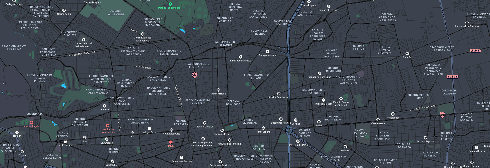

# Propuesta para Análisis de Viabilidad Territorial

EVA: Analista de Viabilidad Territorial aprovecha el análisis avanzado y los modelos de inteligencia artificial (IA) para transformar datos en inteligencia estratégica para las decisiones de desarrollo inmobiliario de Paragon.

## Temas Principales e Ideas Importantes:

### Cambio de Recolección de Datos a Inteligencia Estratégica
STRTGY enfatiza que el verdadero diferenciador en el mercado inmobiliario no es solo recopilar datos, sino la capacidad de convertirlos en información accionable. Como afirma Fabián Salazar, CTO y Co-fundador de STRTGY:

> "En STRTGY, estamos convencidos de que el verdadero diferencial en el mercado inmobiliario no se encuentra únicamente en la recolección de datos, sino en la habilidad de convertirlos en inteligencia estratégica que impulse la toma de decisiones."

### Introducción de EVA (Analista de Viabilidad Territorial)
EVA se presenta como una herramienta que va más allá de simples estudios de ubicación, integrando IA para proyectar tendencias, identificar oportunidades de negocio y personalizar estrategias. Su objetivo es proporcionar una comprensión profunda de las ubicaciones potenciales.

### Beneficios para Paragon
La propuesta destaca varios beneficios clave para Paragon, incluyendo:

<div class="grid grid-cols-4">
  <div class="card">
    
    <h1>Optimización de Operaciones</h1>
    <p style="text-align: justify;">
      EVA está diseñada para revolucionar la forma en que Paragon opera en el mercado inmobiliario. Al proporcionar análisis detallados y recomendaciones basadas en datos, EVA permite a Paragon tomar decisiones más informadas y estratégicas.
      <br><br>
      Esto se traduce en una mayor eficiencia operativa, desde la selección de ubicaciones hasta la planificación de proyectos, lo que ultimadamente resulta en una ventaja competitiva significativa en un mercado cada vez más saturado y complejo.
    </p>
  </div>
  <div class="card">
    
    <h1>Anticipación de Oportunidades</h1>
    <p style="text-align: justify;">
      La capacidad de EVA para proyectar tendencias futuras del mercado inmobiliario es una herramienta poderosa para Paragon. Utilizando modelos predictivos avanzados, EVA puede identificar áreas de crecimiento potencial antes que la competencia, permitiendo a Paragon posicionarse estratégicamente.
      <br><br>
      Esta anticipación no solo maximiza el uso de recursos, sino que también minimiza los riesgos asociados con inversiones inmobiliarias, al proporcionar una visión más clara del panorama futuro del mercado.
    </p>
  </div>
  <div class="card">
    
    <h1>Fortalecimiento de Relaciones</h1>
    <p style="text-align: justify;">
      EVA no solo mejora las operaciones internas de Paragon, sino que también fortalece significativamente las relaciones con los clientes. Al analizar detalladamente las necesidades y preferencias del mercado, EVA permite a Paragon diseñar y ofrecer proyectos que se alinean perfectamente con las demandas de los clientes.
      <br><br>
      Esto resulta en una mayor satisfacción del cliente, lealtad a largo plazo y un posicionamiento más fuerte de la marca Paragon en el mercado inmobiliario.
    </p>
  </div>
  <div class="card">
    
    <h1>Crecimiento Sostenible</h1>
    <p style="text-align: justify;">
      El objetivo final de EVA es facilitar un crecimiento sostenible y a largo plazo para Paragon. Al proporcionar datos confiables y análisis profundos, EVA ayuda a Paragon a tomar decisiones que no solo son rentables a corto plazo, sino que también contribuyen a la estabilidad y el crecimiento a largo plazo de la empresa.
      <br><br>
      Este enfoque basado en datos asegura que cada decisión esté respaldada por una sólida visión comercial, permitiendo a Paragon expandirse de manera controlada y estratégica en nuevos mercados y segmentos.
    </p>
  </div>
</div>

### Especialización y Necesidades de Paragon
El documento reconoce el enfoque de Paragon en el desarrollo y comercialización de propiedades (residenciales, hospitalarias, plazas comerciales con retail, hoteles y restaurantes) en San Luis Potosí y otras regiones estratégicas de México. Señala la necesidad de una metodología clara para la toma de decisiones, desde la selección de ubicación hasta la conceptualización del producto.

### Dos Escenarios de Análisis
EVA ofrece dos enfoques principales:
<div class="grid grid-cols-2">
  <div class="card">
    <h1>Escenario A: Análisis de Ubicación Específica</h1>
    <p style="text-align: justify;">Evaluación detallada de una ubicación predeterminada para determinar su potencial de desarrollo. EVA analiza factores como demografía, infraestructura, competencia y normatividad para recomendar el tipo de proyecto óptimo, ya sea residencial, hospitalario o comercial.</p><p style="text-align: justify;">El análisis incluye estudios de mercado, proyecciones de demanda y evaluación de riesgos específicos del sitio.</p>
  </div>
  <div class="card">
    <h1>Escenario B: Búsqueda de Ubicación Óptima</h1>
    <p style="text-align: justify;">Exploración sistemática de zonas extensas para identificar las mejores ubicaciones según el tipo de desarrollo deseado. EVA emplea algoritmos avanzados de IA que procesan múltiples capas de datos territoriales, incluyendo patrones de crecimiento urbano, tendencias socioeconómicas, planes de desarrollo y restricciones normativas.</p><p style="text-align: justify;">El sistema genera mapas de calor de idoneidad, identifica clusters de oportunidad y propone ubicaciones específicas con su respectiva justificación basada en datos.</p>
  </div>
</div>

### Enfoque Comercial
El análisis se centra principalmente en aspectos comerciales, de mercado y de cumplimiento normativo general. Se excluyen detalles financieros como cálculos de ROI, aunque se considera la relevancia de la seguridad social para la vivienda (créditos Infonavit, Fovissste) para la identificación del mercado objetivo.

> "El enfoque se centra en aspectos comerciales, de mercado y de cumplimiento normativo general, evitando profundizar en temas de financiamiento o cálculos de retorno de inversión (ROI). Sin embargo, sí se contempla la relevancia de la seguridad social para la vivienda (créditos Infonavit, Fovissste) como parte de la identificación del mercado meta."

## Detalles de la Metodología:

### Cobertura Geográfica
```js
import createMap from "./components/simplemap.js";

const container = document.createElement("div");
container.style.height = "400px";
display(container);
createMap(container);
```
Principalmente San Luis Potosí y áreas urbanas/semi-urbanas de interés para Paragon, pero adaptable a otras regiones.

### Tipos de Proyectos
Cubre residencial (varios segmentos), hospitales (con enfoque comercial) y plazas comerciales (incluyendo retail, hoteles y restaurantes).

### Áreas de Análisis
Incluye regulatorio/legal (zonificación, uso de suelo), urbano/infraestructura (accesibilidad, servicios), demográfico/mercado (perfil de población, competencia, hábitos de consumo, seguridad social para vivienda), propuesta de valor (amenidades, tecnología, sostenibilidad) y recomendaciones de comercialización.

### Proceso del Escenario A (Coordenada Específica)
<div class="grid grid-cols-4">
  <div class="card">
    <h2><strong>Caracterización de la Ubicación</strong></h2>
    <p style="text-align: justify;">Mapeo básico detallado que incluye análisis del uso de suelo actual y potencial, identificación de restricciones legales y normativas, evaluación de la disponibilidad y calidad de servicios públicos e infraestructura. Además, se realiza un exhaustivo análisis de accesibilidad, considerando vías de comunicación, transporte público y patrones de movilidad en la zona.</p>
  </div>
  <div class="card">
    <h2><strong>Diagnóstico Comercial</strong></h2>
    <p style="text-align: justify;">Elaboración de un perfil sociodemográfico completo de la zona, incluyendo tendencias de crecimiento poblacional y económico. Análisis profundo de la competencia directa e indirecta, evaluando sus fortalezas y debilidades. Implementación de técnicas avanzadas de segmentación de mercado impulsadas por IA, que permiten identificar nichos de oportunidad y preferencias específicas del consumidor objetivo.</p>
  </div>
  <div class="card">
    <h2><strong>Evaluación de Viabilidad</strong></h2>
    <p style="text-align: justify;">Revisión exhaustiva del cumplimiento normativo, incluyendo regulaciones ambientales y urbanísticas. Análisis detallado de la seguridad en la zona, considerando estadísticas delictivas y percepción ciudadana. Evaluación integral de la calidad de vida, que puede incluir un análisis opcional de sentimiento en redes sociales para captar la opinión pública sobre el área y sus alrededores, proporcionando una visión más completa del entorno social y comunitario.</p>
  </div>
  <div class="card">
    <h2><strong>Conclusiones</strong></h2>
    <p style="text-align: justify;">Presentación detallada de la viabilidad de cada tipo de proyecto considerado, respaldada por datos cuantitativos y cualitativos. Identificación de oportunidades únicas de diferenciación basadas en las características específicas del lugar y las tendencias del mercado. Recomendaciones estratégicas para maximizar el potencial del proyecto, incluyendo posibles alianzas, innovaciones en diseño o servicios que podrían dar una ventaja competitiva significativa.</p>
  </div>
</div>

### Proceso del Escenario B (Región Más Amplia)
<div class="grid grid-cols-4">
  <div class="card">
    <h2><strong>Definición de Criterios y Ponderación</strong></h2>
    <p style="text-align: justify;">Establecimiento de criterios generales como accesibilidad, disponibilidad de servicios públicos, oferta de terrenos y niveles de seguridad. Además, se definen criterios específicos según el tipo de proyecto, por ejemplo, alta concentración de trabajadores formales para desarrollos residenciales, áreas con demanda insatisfecha de servicios de salud para proyectos hospitalarios, o zonas de alto tráfico peatonal y vehicular para complejos comerciales. La ponderación de estos criterios se realiza mediante análisis estadísticos avanzados y consultas con expertos del sector.</p>
  </div>
  <div class="card">
    <h2><strong>Recopilación y Cruce de Datos Territoriales</strong></h2>
    <p style="text-align: justify;">Implementación de Sistemas de Información Geográfica (SIG) para la creación de mapas detallados y precisos. Utilización de técnicas de Inteligencia Artificial para realizar análisis multicapa, integrando diversas fuentes de datos como censos, registros catastrales, y datos de movilidad urbana. Aplicación de modelos avanzados de clustering para identificar patrones espaciales y modelos predictivos para estimar la demanda futura en diferentes zonas.</p>
  </div>
  <div class="card">
    <h2><strong>Selección Preliminar de Sitios Candidatos</strong></h2>
    <p style="text-align: justify;">Empleo de técnicas de análisis multicriterio para evaluar y comparar diferentes ubicaciones potenciales. Utilización de algoritmos de optimización para identificar las mejores combinaciones de características deseables. Aplicación de filtros basados en restricciones normativas, ambientales y de mercado para refinar la lista de sitios candidatos, asegurando que cumplan con todos los requisitos legales y estratégicos del proyecto.</p>
  </div>
  <div class="card">
    <h2><strong>Validación de Campo y Contexto Local</strong></h2>
    <p style="text-align: justify;">Realización de visitas in situ para verificar las condiciones reales de los terrenos seleccionados. Utilización de imágenes satelitales de alta resolución para un análisis detallado del entorno. Involucramiento de actores locales clave, como autoridades municipales y líderes comunitarios, para obtener insights valiosos sobre el contexto social y económico. Complementación del análisis cualitativo con hallazgos obtenidos mediante técnicas de IA, como el análisis de sentimiento en redes sociales y la minería de datos de fuentes locales.</p>
  </div>
  <div class="card">
    <h2><strong>Identificación de la Ubicación Óptima</strong></h2>
    <p style="text-align: justify;">Elaboración de propuestas detalladas para los polígonos más prometedores, incluyendo un análisis exhaustivo de sus ventajas competitivas y posibles desafíos. Creación de mapas interactivos que visualicen claramente la ponderación de los diferentes criterios evaluados. Presentación de recomendaciones finales respaldadas por un sólido análisis de datos, proyecciones de desarrollo urbano y consideraciones de sostenibilidad a largo plazo.</p>
  </div>
</div>

### Directrices Específicas por Tipo de Proyecto
La propuesta describe áreas de enfoque clave para cada tipo de desarrollo, integrando IA donde sea relevante:

<div class="grid grid-cols-4">
  <div class="card">
    <h2><strong>Vivienda</strong></h2>
    <ul>
      <li>Demanda del mercado (compradores potenciales con seguridad social, jóvenes profesionales, familias)</li>
      <li>Precios</li>
      <li>Competencia</li>
      <li>Propuesta de valor (amenidades, sostenibilidad)</li>
      <li>Estrategias de comercialización (alianzas, casas modelo, marketing digital)</li>
    </ul>
  </div>
  <div class="card">
    <h2><strong>Salud</strong></h2>
    <ul>
      <li>Demanda y cobertura de servicios (especialidades requeridas, población objetivo)</li>
      <li>Competencia (número de instalaciones, especialidades)</li>
      <li>Demanda de especialidades específicas</li>
      <li>Ubicación/accesibilidad (proximidad a vías, transporte público)</li>
      <li>Servicios diferenciados/posicionamiento de marca (especialidades clave, experiencia del paciente, análisis de reputación online usando análisis de sentimiento)</li>
    </ul>
  </div>
  <div class="card">
    <h2><strong>Plazas Comerciales</strong></h2>
    <ul>
      <li>Perfil del público objetivo y demanda (local vs. turista/externo)</li>
      <li>Análisis socioeconómico (demanda de marcas premium/comerciales, tipos de restaurantes, categorías de hoteles)</li>
      <li>Hábitos de consumo y flujos de visitantes (horas pico, patrones de movilidad)</li>
      <li>Competencia y entorno comercial (análisis de complejos similares, oferta de hoteles y restaurantes)</li>
      <li>Ubicación, accesibilidad y sinergias entre componentes (retail, restaurantes, hotel)</li>
    </ul>
  </div>
  <div class="card">
    <h2><strong>Análisis Adicional</strong></h2>
    <ul>
      <li>Tendencias del mercado inmobiliario</li>
      <li>Proyecciones de crecimiento urbano</li>
      <li>Impacto ambiental y sostenibilidad</li>
      <li>Regulaciones y políticas locales</li>
    </ul>
  </div>
</div>

### Entregables

- Mapeo base georreferenciado y capas temáticas (SIG)
- Repositorio de datos demográficos y de mercado
- Informes de viabilidad para los Escenarios A y B
- Presentaciones de resumen ejecutivo
- Manual de usuario y consulta